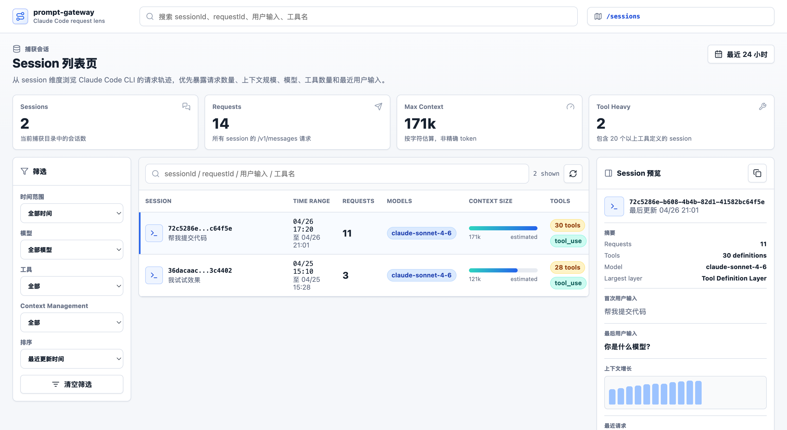
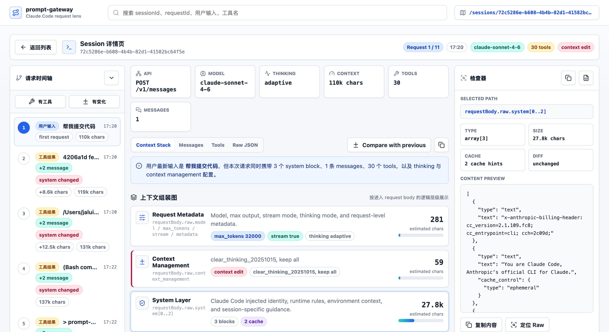
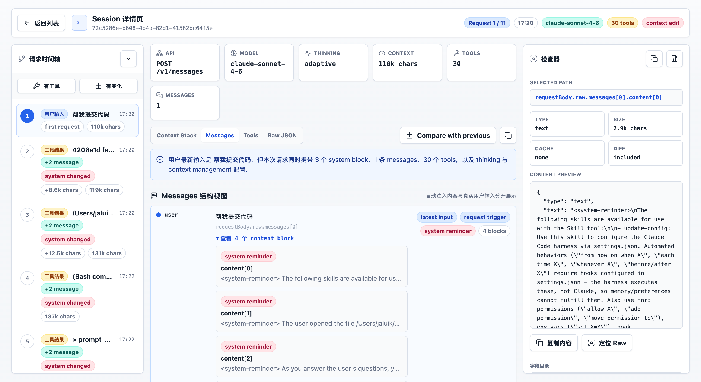

# prompt-gateway

[中文文档](./README.md)

Local proxy that captures the full `/v1/messages` requests and responses from Claude Code. Comes with a web UI for browsing sessions and comparing context changes.

```bash
npx prompt-gateway claude
```

Launches Claude Code behind a local proxy. All requests are forwarded to your real upstream and saved locally. Open `http://127.0.0.1:8787/` to browse.

## Screenshots

Session list:



Request detail — system prompt, messages, and tools broken into layers:



The messages view labels user inputs vs tool results. Claude Code puts both in `role: "user"` messages, so you can't tell them apart from the raw JSON:



## Install

Requires Node.js 16+.

```bash
npx prompt-gateway claude
```

Or install globally:

```bash
npm install -g prompt-gateway
prompt-gateway claude
```

Default port is 8787, auto-selects another if occupied. Captures are saved under `.claude/prompt-gateway/captures/` by date.

## How It Works

1. Starts a local HTTP proxy
2. Sets `ANTHROPIC_BASE_URL` to the local proxy and launches Claude Code
3. Forwards requests to the real upstream (read from env vars, CLI flags, or Claude Code settings)
4. Saves requests and responses

If Claude Code settings already have `ANTHROPIC_BASE_URL`, it's used as the upstream automatically.

Sensitive headers (`authorization`, `x-api-key`, `cookie`) are replaced with `[REDACTED]` before saving.

## Options

```bash
# Pass args to Claude Code
npx prompt-gateway claude -- --print "hello"

# Custom upstream
npx prompt-gateway claude --upstream-url https://your-proxy.example.com

# Custom claude path
npx prompt-gateway claude --claude-command /path/to/claude

# JSON only
npx prompt-gateway claude --no-html
```

Full reference: `npx prompt-gateway --help`.

## Limits

Only the Anthropic-native API (`ANTHROPIC_BASE_URL`) is supported. Bedrock, Vertex, Foundry are not.

Development notes: [DEVELOPING.md](./DEVELOPING.md).
